# Project-Symbiont-LiDAR
Design files for a support and interface unit for the Garmin LiDAR Lite


***The symbiont.*** *Lichens, like this Reindeer Lichen found in northeastern
Minnesota, are a symbiosis between fungi and algae. Our symbiosis is between
silicon, copper, aluminum, and laser. But be it nature or machine, some
partnerships are truly mutual in their benefits. Photo by Homer Edward Price.*

The [LiDAR Lite](https://buy.garmin.com/en-US/US/p/578152/pn/010-01722-10) is a rangefinder from Garmin capable of returning distances to objects up to 40 m away. It is an effective sensor for water, snow, and ice levels, among other purposes. Extensive work to characterize the LiDAR Lite for environmental sensing of water levels has been performed by:

Paul, J. D., Buytaert, W., & Sah, N.(2020). A technical evaluation of lidar-based measurement of riverwater levels. *Water Resources Research*, *56*, e2019WR026810. https://doi.org/10.1029/2019WR026810

## Technical specifications

### Electronic Hardware

* Microcontroller (computer) core
  * ATTiny1634
  * [Firmware](Firmware) written in Arduino-compatible C++
  * 12 MHz
* Sensors
  * Externally connected: [Garmin LiDAR Lite v3 HP](https://buy.garmin.com/en-US/US/p/578152/pn/010-01722-10)
  * On board
    * MEMS accelerometer to detect board angle
    * Hall-effect sensor to for user to trigger with a magnet after providing a known angle to the accelerometer. This corrects for offset errors in the accelerometer, significantly improving its angular accuracy.
* Connections and communications protocols
  * [LiDAR Lite v3 HP](https://buy.garmin.com/en-US/US/p/578152/pn/010-01722-10)
    * 6-pin screw-terminal header
    * Switchable 5V power supply
    * I2C
  * Data logger
    * Power in and Ground
    * Digital communications
      * I2C
      * SPI
* Power
  * Voltage limits: **@bschulz1701?**
  * Power consumption: **@bschulz1701?**
  * ***Anything about power regulation to LiDAR Lite***
* Fault recovery **@bschulz1701: anything here about how you use this to keep the LiDAR Lite's firmware issue(s) from causing the logger to hang, by shielding it with this board?**
* Status LED **Include flash pattern details once defined**
* Open-source licensing via CC BY-SA 4.0


### Electronic Software and Firmware

* Programmable using the Arduino IDE https://www.arduino.cc/en/main/software
* [Firmware](Firmware) available in this repository. At the time of writing, "LiDAR_InterfaceDemo" is the most up-to-date prototype firmware.
* [Software ](https://github.com/NorthernWidget-Skunkworks/Symbiont-LiDAR_Library) to use the Symbiont-LiDAR with Arduino-compatible devices
* Open-source licensing via GNU GPL 3.0

>> @bschulz1701: Finalize a firmware version?

## Assembly

Assembling this sensor is possible by hand with sufficient skill and the following tools:
* Temperature-controlled soldering iron
* Hot-air rework station
* Equipment for stenciling with solder paste
* ESD-safe tweezers and workstation
* Solder wick

Most of the components on this board are coarse enough in pitch that assembly by hand is expected to be relatively straightforward. However, if you are concerned about this, there are PCB assembly workshops located in many parts of the world.
>> THOUGHT: I have basic instructions for assembly on the [Project Walrus](https://github.com/NorthernWidget-Skunkworks/Project-TPDH-Walrus) README; I will not reproduce these here just yet, as we might want to set up a separate assembly guide, mostly with good links to existing resources, since our writing something of this nature would be to reinvent the wheel.

## Uploading the firmware

### Downloading and installing the Arduino IDE

Go to https://www.arduino.cc/en/main/software. Choose the proper IDE version for your computer. For Windows, we suggest the non-app version to have more control over Arduino; this might change in the future. You will have to add custom libraries, so the web version will not work (at least, as of the time of writing). Download and install the Arduino IDE. Open it to begin the next steps.

### AVR ISP

To install firmware on the Symbiont board, you use the 2x3-pin 6-pin ICSP (also called ISP) header with a special device called an "in-circuit system programmer" (or just "in-system programmer; yup, that's what the acronym stands for).

Many devices exist to upload a bootloader including:
* The official [AVR ISP mkII](http://ww1.microchip.com/downloads/en/DeviceDoc/Atmel-42093-AVR-ISP-mkII_UserGuide.pdf) (no longer produced but available used)
* Using an [Arduino as an ISP](https://www.arduino.cc/en/tutorial/arduinoISP)
* The versatile [Olimex AVR-ISP-MK2](https://www.olimex.com/Products/AVR/Programmers/AVR-ISP-MK2/open-source-hardware)
* The [Adafruit USBtinyISP](https://www.adafruit.com/product/46)

### Uploading the firmware

Using this ISP, upload (as of the time of writing): [the Arduino sketch in this folder](Firmware/LiDAR_InterfaceDemo/). To do so, follow these steps:

1. Open the Arduino IDE. **MIGHTY CORE LIBRARIES NEEDED???**
2. Select the desired board -- **look up mighty core**
3. **power needed beyond ISP?**
4. Plug your ISP of choice into your computer (via a USB cable) and onto the 6-pin header. There are two ways to place it on; the header is aligned such that the ribbon cable should be facing away from the board while programming. If this fails without being able to upload, try flipping the header around.
5. Go to Tools --> Programmer and select the appropriate programmer based on what you are using.
6. Go to Sketch --> Upload Using Programmer. After several seconds, you learn whether you succeeded or failed. Hopefully it worked!


***Uploading using the in-system programmer.***

>> @bschulz1701: MightyCore library needed? Just the normal 1634 or anything special?

>> @bschulz1701: Any power supply needed beyond what ICSP header provides?

***Important note for Linux users:*** You must supply permissions to the Arduino IDE for it to be able to use the ICSP, or you will have to run it using `sudo`. The former option is better; the latter is easier in the moment.


## Writing a program to connect to the Symbiont-LiDAR

Once it is bootloaded and connected with a LiDAR Lite sensor, you should be able to use any standard Arduino device to connect to it and read its data.

### Very simple Arduino code

This code is intended for any generic Arduino system.

```c++
// Include the Symbiont library
#include "SymbiontLiDAR"

// Declare variables -- just as strings
String header;
String data;

// Instantiate class
SymbiontLiDAR myLaser;

void setup(){
    // Begin Serial connection to computer at 38400 baud
    Serial.begin(38400);
    // Obtain the header just once
    header = myLaser.getHeader();
    // Print the header to the serial monitor
    Serial.println(header);
}

void loop(){
    // Take one reading every (10 + time to take reading) seconds
    // and print it to the screen
    myLaser.updateMeasurements();
    data = myLaser.getString();
    Serial.println(data);
    delay(10000); // Wait 10 seconds before the next reading, inefficiently
}
```

### Northern Widget Margay code

The [Margay data logger](github.com/NorthernWidget-Skunkworks/Project-Margay) is the lightweight and low-power open-source data-logging option from Northern Widget. It saves data to a local SD card and includes on-board status measurements and a low-drift real-time clock. We have written [a library to interface with the Margay](github.com/NorthernWidget-Skunkworks/Margay_Library), which can in turn be used to link the Margay with sensors.

```c++
// Include the Symbiont library
#include "Margay.h"
#include "SymbiontLiDAR.h"

// Declare variables -- just as strings
String header;
String data;

// Instantiate classes
SymbiontLiDAR myLaser;
Margay Logger(Model_2v0, Build_B); // Margay v2.2; UPDATE CODE TO INDICATE THIS

// Empty header to start; will include sensor labels and information
String Header = "";

// I2CVals for Symbiont
uint8_t I2CVals[] = {0x40}; // DEFAULT BUT CLASHES WITH HAAR

//Number of seconds between readings
uint32_t updateRate = 60;

void setup(){
    Header = Header + myLaser.GetHeader();
    Logger.begin(I2CVals, sizeof(I2CVals), Header);
    init();
}

void loop(){
    init();
    Logger.Run(update, updateRate);
}

String update() {
    init()
    return myLaser.GetString();
}

void init(){
    myLaser.begin();
}
```

### Northern Widget Resnik code

>> Currently nearly identical to Margay code, by design. Add telemetry with Particle Boron.

```c++
// Include the Symbiont library
#include "Resnik.h"
#include "SymbiontLiDAR.h"

// Declare variables -- just as strings
String header;
String data;

// Instantiate classes
SymbiontLiDAR myLaser;
Resnik Logger();

// Empty header to start; will include sensor labels and information
String Header = "";

// I2CVals for Symbiont
uint8_t I2CVals[] = {0x40}; // DEFAULT BUT CLASHES WITH HAAR

//Number of seconds between readings
uint32_t updateRate = 60;

void setup(){
    Header = Header + myLaser.GetHeader();
    Logger.begin(I2CVals, sizeof(I2CVals), Header);
    init();
}

void loop(){
    init();
    Logger.Run(update, updateRate);
}

String update() {
    init()
    return myLaser.GetString();
}

void init(){
    myLaser.begin();
}
```

## Housing and cabling

### Parts required

This is what we used for our build; you can be creative based on materials and availability.

* Main enclosure
  * Polycase box [WC-20F (clear lid)](https://www.polycase.com/wc-20f)
  * [2x \#4 screws](https://www.polycase.com/screws-mbr-100) to mount Symbiont in box
  * Cable gland (MODEL NUMBER) for cable to LiDAR Lite
  * Strain-relieved cable gland (MODEL NUMBER) for cable to logger
  * Desiccant packs
* LiDAR Rangefinder
  * [LiDAR Lite sensor](https://www.sparkfun.com/products/14599)
  * [4 sealing screws](https://www.mcmaster.com/90825A142): \#4-40 x 5/16"
  * [4 washers](https://www.mcmaster.com/90107A005) for \#4 screws
  * [4 cap nuts](https://www.mcmaster.com/99022A101) for \#4-40 screws
* Cable to logger
  * 3 m (or less) [4-conductor AlphaWire](https://www.digikey.com/product-detail/en/alpha-wire/5004C-SL001/5004CSL001-ND/484976), stripped and tinned at both ends. Other cables will work too; this is what we have found to be highest quality and reliability.
* Mounting plates (see [CNC files](CNC) for fabrication)
  * Delrin sheet **dimensions?**
  * U bolts **dimensions?**
  * 1/4"-20 nuts, washers, and bolts **1 inch?**

>>@bschulz1701 Delrin dimensions?
>>@bschulz1701 Link to Easel too?

### Assembly

1. Drill and tap the holes in the side of the box.

>> Bobby: are the holes in the walls of the box tapped? Size? Measurements?

2. Install the sensor as shown below using two of the \#4 self-tapping screws. By mounting the LiDAR Lite at an angle, you can fix it to the box lid in a way that still allows the box to open and close properly.

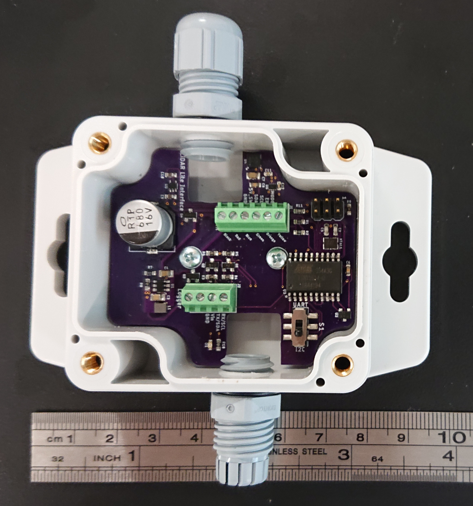

3. Using the sealing screws, cap nuts, and washers, install the LiDAR Lite sensor onto the lid. The cap nuts go on the outside of the housing.

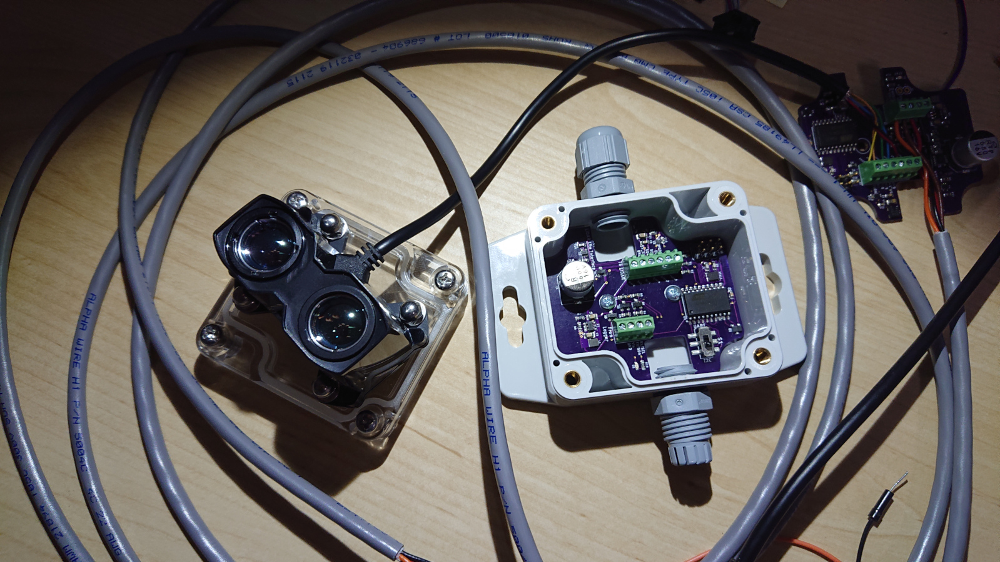

4. Thread the cables through the cable glands and attach them to the screw terminals. A 1.8 mm flat-head screwdriver can be very useful for this. Note that these cables cross the board in the above image (upper left) -- and that (unlike in the image!) you should do this *after* the board is in the box.

5. Using the switch in the box, select the desired communications protocol.

6. Attach the cable to the data logger.

7. Test the LiDAR Lite unit.

8. When satisfied with the tests, turn off the data logger and place a protective cover over the lenses of the LiDAR Lite for safety during transport. We have [a set of "safety glasses" available for 3D printing](3Dprint).

9. Place desiccant in the box.

10. Securely screw the lid onto the box to seal the LiDAR Lite + Symbiont unit.

11. Mark the corner of the box next to the Hall-effect sensor, and mark the orientations of the roll and pitch axes.
>> @bschulz1701 Any tips on this locations / orientations? I'm being lazy though; could look at the schematic myself.

12. Place the box on a measured flat surface and tap the magnet to the marked location by the Hall Effect sensor. This will appropriately zero the offsets for the sensor and increase its near-horizontal accuracy significantly. For a convenient magnet holder, you can use our [3D-printable magnetic wand][3Dprint], which holds a small rare-Earth magnet.
>> @bschulz1701: Magnet model/dimensions?

13. Use the bolts to attach the LiDAR Lite box to [the mounting plate](CNC).


14. (Can wait for field installation) attach the unit via its mounting plate to the appropriate pipe, post, etc.

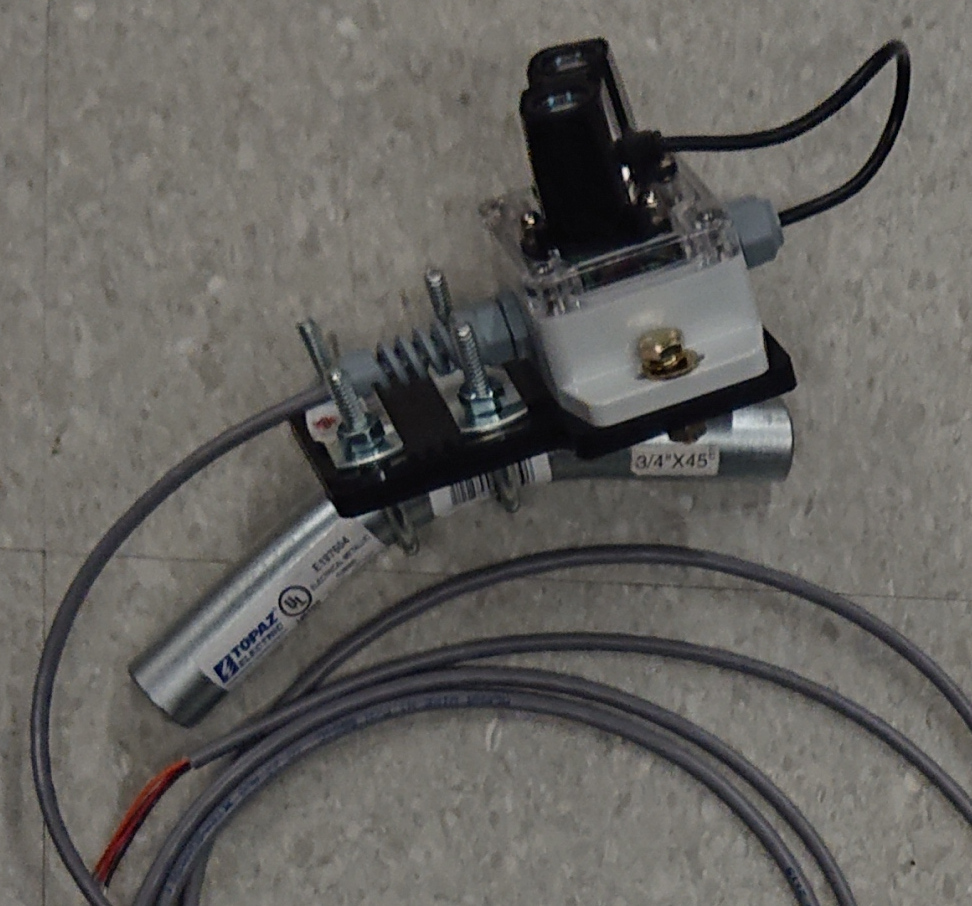

## Field installation

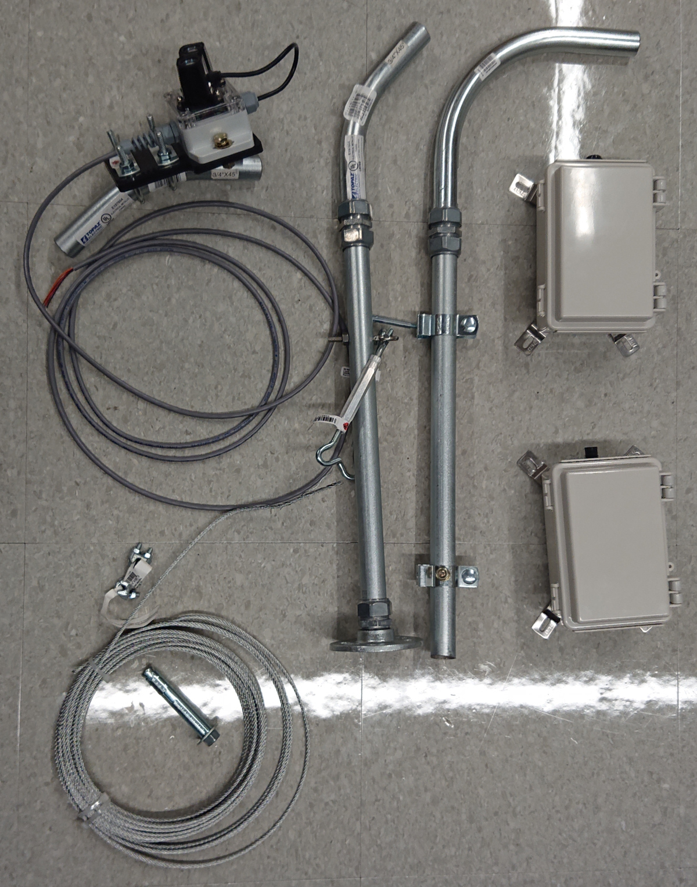

***Lab mock-up of field installation for LiDAR Lite.*** The boxes at right contain [Northern Widget Margay](https://github.com/NorthernWidget-Skunkworks/Project-Margay) data loggers with a single cable gland to connect to the Symbiont box. The two posts next to them provide examples of how to connect the 3/4" EMT conduit to some fixed point in the environment, either the side of a flat(ish) wall (right) -- though the brackets aren't necessary or even always good, since we can bolt right through the pipe -- or to a flat(ish) surface using a floor flange. We drilled holes through the conduit to attach 1/4" eye bolts (1/4"-20, 1.5" long) using nuts, lock washers, and washers, to the conduit. These eye bolts then held turnbuckles to which we attached cables (lower left). The other end of the cables can be attached via sleeve or wedge anchors to rock, or to other sturdy structures. The LiDAR Lite + Symbiont is in the upper left corner, albeit attached in a way that would have it looking up... unless it were attached to the end of the 90-degree bend.

### Mast construction

#### Supplies

* 3/4" EMT rigid conduit
* 3/4" Conduit screw-down connectors (to join multiple pieces of conduit)
* 3/4" Conduit-to-threaded connectors (to link smooth conduit to threaded 3/4" plumbing, needed only if you use a floor flange)
* Floor flange (1, if you want to attach to a flat surface)
* 1/4-20 x 1.5" eye bolts (3, +1 in case you bend/break one)
* 1/4" x 2+" long sleeve or wedge anchors; 4 for the floor flange or 2 for bolting into the side of a rock. Extras suggested, as these can be broken during installation.
* Turnbuckles; I suggest getting 3 that are threaded all the way down (as shown in the picture above). Get an extra in case you break one.
* 1/8" metal cable
* 1/8" cable clamps (x6, +1 in case you lose the nuts)
* 1/8" metal cable turns (x6; if you lose one, don't worry; these are nice for durability but not totally necessary)
* 3/8" x 2.5+" long sleeve or wedge anchors for the cables; these are less breakable than their 1/4" cousins, but you might still want an extra one.
* Extra 1/4"-20 hardware. I almost always end up needing this.

You might not need the guy wires and associated hardware if you bolt your assembly to the side of something (like a rock or wall).

#### Assembly

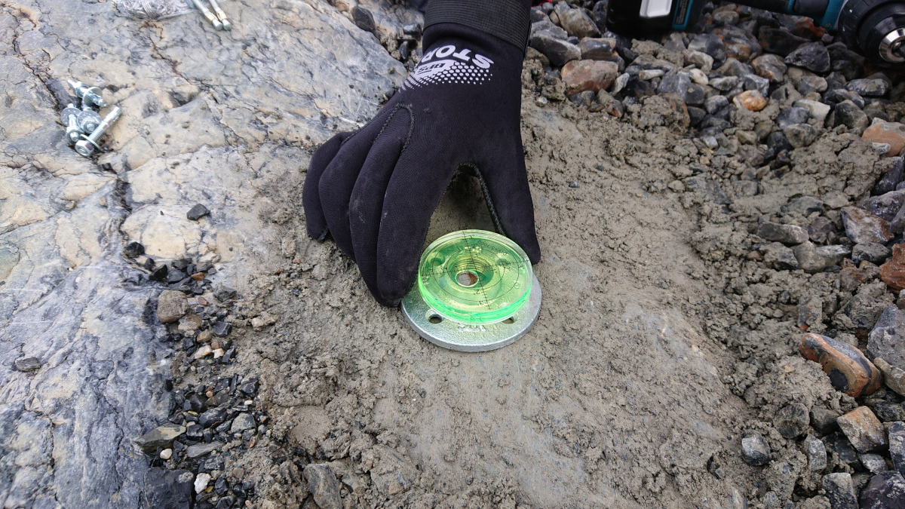
***Placing and leveling the base.***

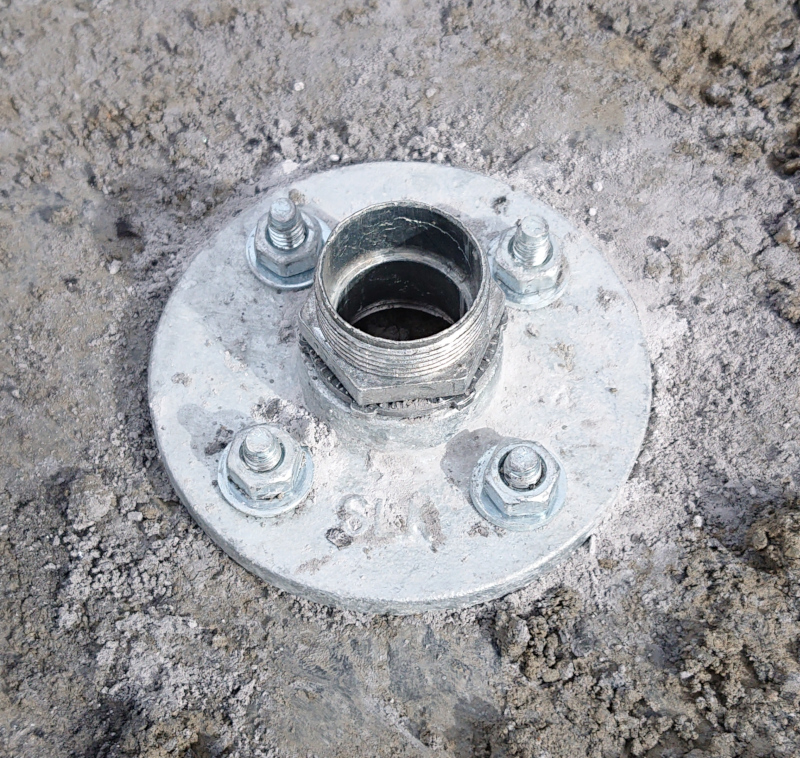
***Installing the base using wedge anchors.***

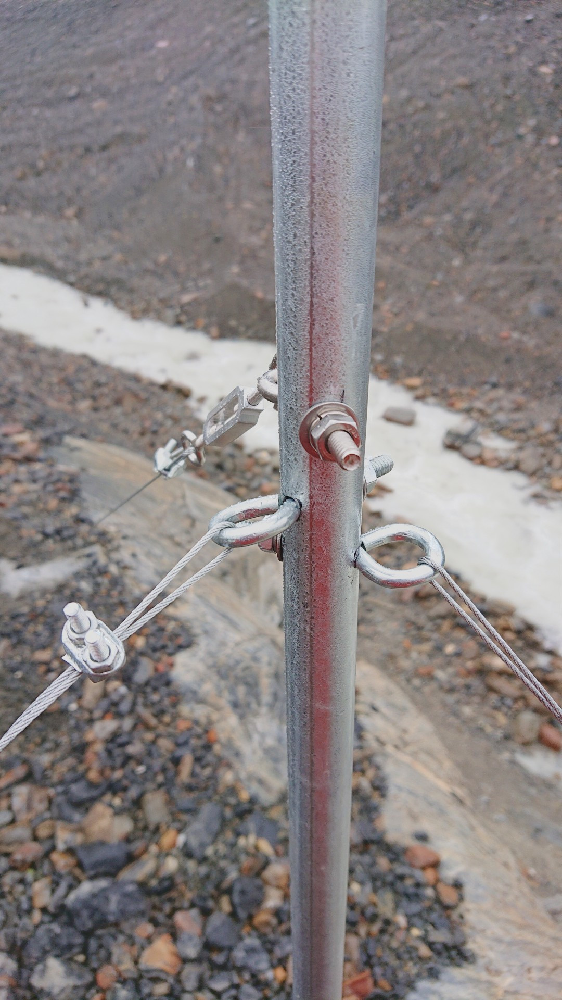
***Installing the conduit and anchoring it with eye bolts and turnbuckles.*** Before going out to the field, we strongly suggest you pre-drill the holes and pre-install the eye bolts.

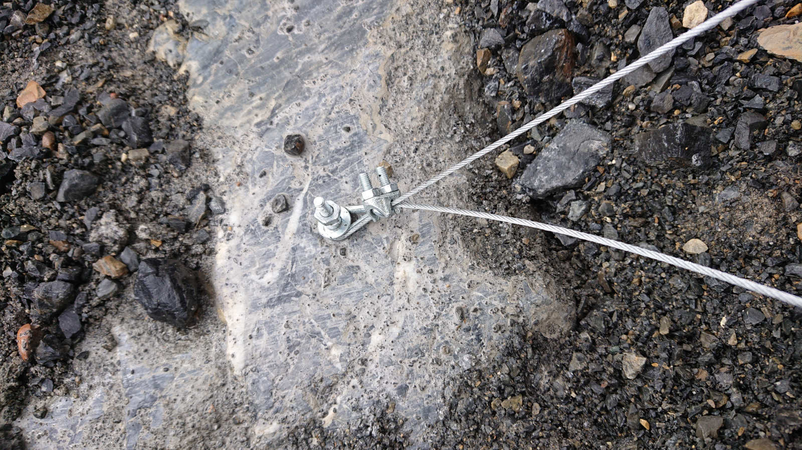
***Tightening the cable around the bolt in the rock using the cable clamp.***

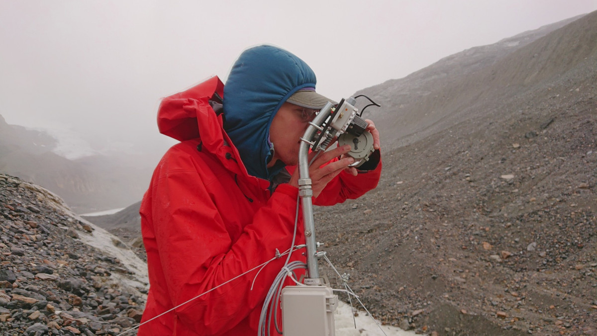
***Aiming the LiDAR Lite unit at the river.*** In future models, we are considering adding peep sights to the mounting bracket. [Professor Billy Armstrong](https://earth.appstate.edu/faculty-staff/dr-william-h-armstrong) in the photo.

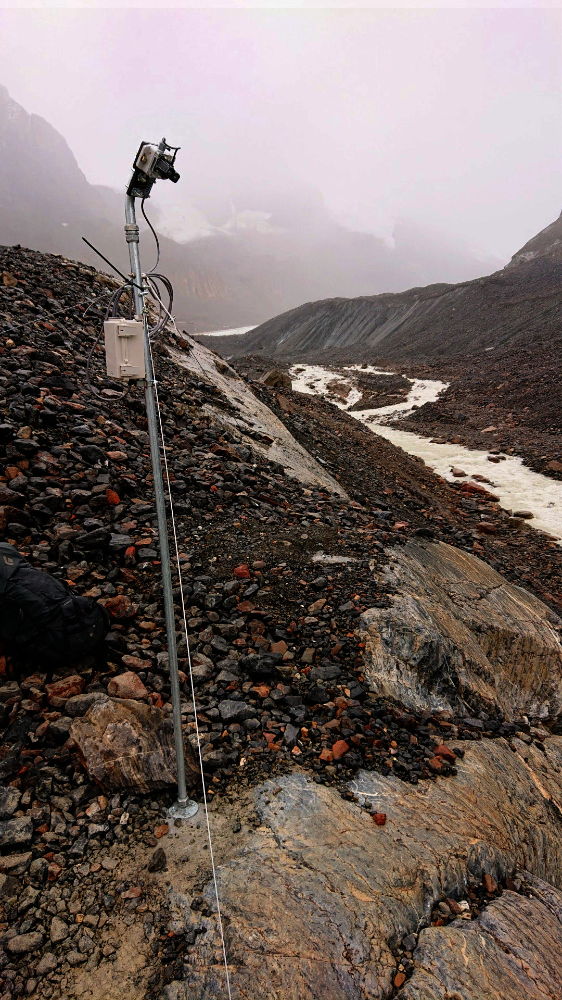
***Fully installed clifftop unit***

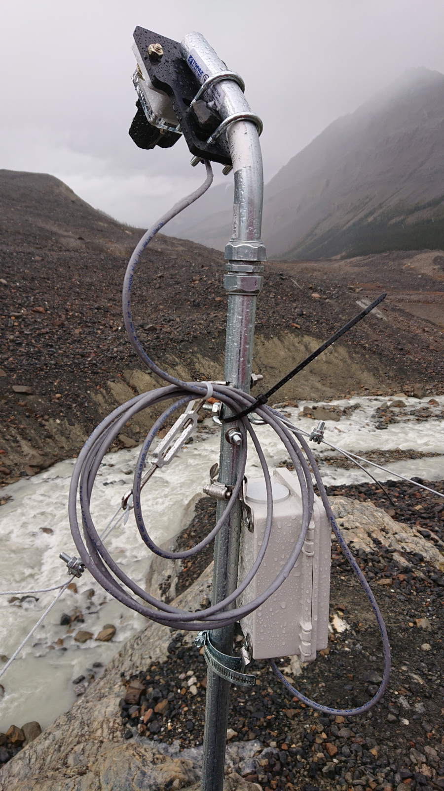
***Fully installed clifftop unit*** *Note additional assembly item if you use this method: ~1-3/4" hose clamps to attach data-logger box to post.*


***Alternative method: installing on the side of a rock.***


***Full mast installed on the side of a rock.*** *Note the LiDAR Lite + Symbiont and the data-logger box.


<br>
<a rel="license" href="http://creativecommons.org/licenses/by-sa/4.0/"></a><br />This work is licensed under a <a rel="license" href="http://creativecommons.org/licenses/by-sa/4.0/">Creative Commons Attribution-ShareAlike 4.0 International License</a>.
