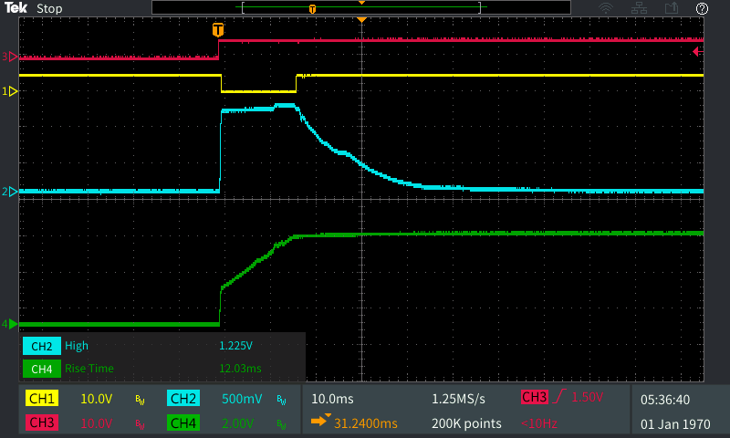
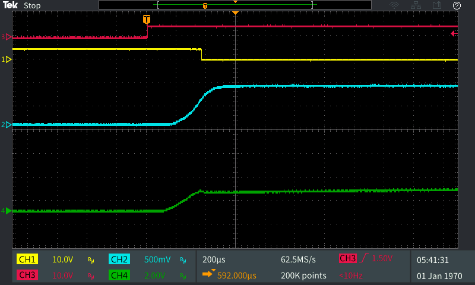

# Testing
### Power Switch

#### Switching Capacitive Load
The following is a breadboard test with an MIC2544 load switch, with a 1k&Omega; limit resistor (0.23A) switching 5v onto a discharged 680uF capacitor. The power supply which drives this circuit was set for 5v and 0.5A current limit (in order to prevent external limiting). In this capture we see the load switch limiting the current to the capacitor, increasing the rise time (to 12ms) and preventing problematic current draws onto the data logger. 

* Red -> `EN`
* Yellow -> `FLG`
* Blue -> IIn (10V/A)
* Green -> VOut

The following shows the same event, but a detailed view of the turn on event to illustrate the timing and current peak in more detail

* Red -> `EN`
* Yellow -> `FLG`
* Blue -> IIn (10V/A)
* Green -> VOut