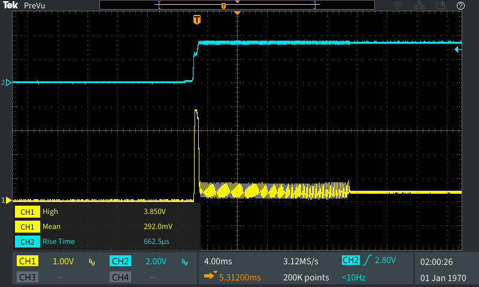
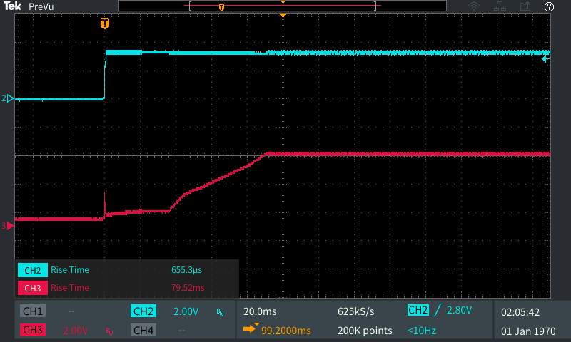

# Testing
### Power Switch

#### Switching Capacitive Load
The following is a breadboard test with an MIC2544 load switch, with a 1k&Omega; limit resistor (0.23A) switching 5v onto a discharged 680uF capacitor. The power supply which drives this circuit was set for 5v and 0.5A current limit (in order to prevent external limiting). In this capture we see the load switch limiting the current to the capacitor, increasing the rise time (to 12ms) and preventing problematic current draws onto the data logger. 

* Red -> `EN`
* Yellow -> `FLG`
* Blue -> IIn (10V/A)
* Green -> VOut

The following shows the same event, but a detailed view of the turn on event to illustrate the timing and current peak in more detail

* Red -> `EN`
* Yellow -> `FLG`
* Blue -> IIn (10V/A)
* Green -> VOut

##### v0.1 Update
Testing for v0.1 hardware (switched from MOSFET control to MIC2544 load switch with current limiting)

Inrush current with Margay v2.2 output rail used as power supply. RLim = 2.2k&Omega; 
Note, initial inrush spike, then reduced current. Initial spike does not result in brown out of Margay. LiDAR Lite static current consumption is able to be supported by the Margay v2.2 external 3.3v rail.

* Yellow -> IIn (10V/A)
* Blue -> VIn 

This figure shows the same waveform as above, but a detailed view of the switching 

* Yellow -> IIn (10V/A)
* Blue -> VIn 

This figure shows the risetime of the 5v switched rail on board the Symbiont board. In this case we see the rise time which is controlled by the limiting of the current from the MIC2544 switch (RLim = 2.2k&Omega;)

* Red -> V5v_SW
* Blue -> VIn 

The following shows the problem if the current limit is set too high (RLim = 1.05k&Omega;), the core 5v rail sags (due to hitting the current limit of the boost converter), which causes the brown out detect to engage and lock the device into a perpetual reset state. After the reset is triggered due to the sag of the core voltage below 4.3v (brownout limit), we see oscillation occur and the device held in reset.

* Red -> V5v_Core
* Yellow -> IIn 